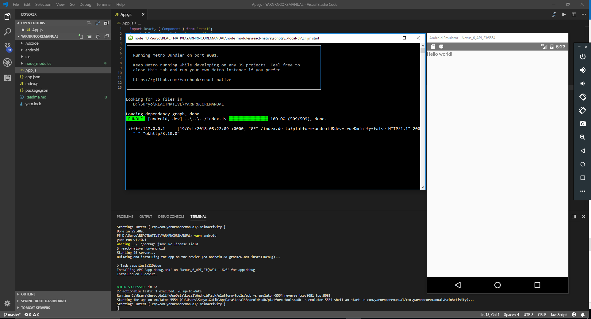

# REACT-NATIVE YARN MANUAL INSTALL

>> ## REQUIREMENT TOOLS
1. CODE EDITOR
2. NodeJS
3. Yarn
4. .Git

>> ## DEPENDENCIES CORE
Install semua dependency dibawah secara global menggunakan "yarn" :
1. react
2. react-native
3. babel-runtime atau @babel/runtime
4. babel-jest
5. jest
6. react-navigation
7. react-test-renderer
8. schedule
9. metro-react-native-babel-preset

>> ## PRE-INSTALL
1. Buatlah sebuah folder baru yang akan digunakan sebagai root project react-native nantinya
2. Buka command line editor "CMD Windows" atau "Linux Term". Berhubung saya menggunakan OS Windows dan Code Editor VS Code, jadi saya menggunakan terminal dari VS Code.
3. Arahkan ke direktori / folder yang baru kita buat pada langkah 2 diatas.
4. Definisikan package.json menggunakan yarn dengan perintah "yarn init". (Ikuti langkah yarn command dengan baik ya). Yang perlu diperhatikan adalah pemberian value pada "name", "main", dan "license". Karena akan digunakan untuk register awal yarn dan react-native nantinya.
5. Jika langkah definisi project menggunakan yarn. lanjutkan dengan eksekusi command : "yarn install". Untuk apa ? Untuk instalasi project dan registrasi node_modules yang akan digunakan menggunakan yarn dan react-native
6. Kemudian, tambahkan semua dependency pada list "DEPENDENCIES CORE" diatas ke dalam project file package.json menggunakan yarn add. (Disini Kita menggunakan file yang telah kita install secara global tadi). dengan perintah : "yarn add file:NODE_MODULEDIREKTORI_GLOBAL_YARN\NAMA_DEPENDENCY". contoh jika pada project saya ini menjadi : "yarn add file:C:\Users\Suryo.Galih\AppData\Local\Yarn\Data\global\node_modules\react".
7. Lakukan langkah 6 untuk semua list DEPENDENCIES CORE. ga ada cara lebih simple ? Kan Kalau Dependency nya banyak gimana ? Ada. pasti ada. tapi coba aja dulu yang ini.
8. Setelah selesai menambahkan semua dependency yang dibutuhkan. silahkan configurasi manual package.json dengan ,menambahkan script dibawah :
 - definisi script action yarn (Untuk mendefinisi / kostum perintah yang kita butuhkan sesuai penamaan script baru yang kita inginkan dalam yarn). istilah tren jaman now 1 pintu, seperti script dibawah :
   ```javascript
        "scripts": {
            "generate-mobile": "react-native eject",
            "start": "yarn node_modules/react-native/local-cli/cli.js start",
            "test": "jest",
            "android": "react-native run-android"
        },
        "jest": {
            "preset": "react-native"
        }
   ```
9. Untuk "Nama Perintah dalam Scripts" bisa disesuikan dengan kebutuhan kita. Script diatas agar kita bisa mengubah perintah dasar menjadi nama perintah yang kita inginkan.
10. Jika Sudah Sesuai, lalu jalankan perintah "yarn install". (Commandline ada dalam direktori yang kita buat pada point 1). maka package,json akan di eksekusi dan diinstall dan terekam dalam yarn.lock
11. Jika sukses. lanjut eksekusi react-native dengan mendefinisikan project folder android dan ios serta meregistrasi sebagai project baru.
12. Sebelum mengeksekusi perintah react-native, silahkan membuat definisi project react-native dulu untuk menggenerasi folde android dan ios nantinya serta meregistrasi project tersebut. Buatlah file "app.json" pada root direktori project. kenapa app.json, sebab default nama app dan app file react-native adalah aap dan definisinya adalah json maka jadilah file app.json.
13. Setelah file dibuat isi script dibawah kedalam file tersebut :
    ```json
        {
            "name": "NAMA_SESUAI_DENGAN_NAMA_DALAM_FILEPACKAGE.JSON",
            "displayName": "NAMA_SESUAI_DENGAN_NAMA_DALAM_FILEPACKAGE.JSON"
        }
    ```
14. Lalu buat lagi file index.js sebagai core file eksekusi project app dengan isi script dibawah ini :
    ```javascript
        import { AppRegistry } from 'react-native';
        import App from './App';
        import { name as appName } from './app.json';
        AppRegistry.registerComponent(appName, () => App);
    ```
15. Kemudian eksekusi perintah "react-native eject". Dikarenakan kita sudah mendefinisikan ulang script untuk eksekusi ini kita bisa menggunakan perintah eksekusi diatas menjadi "yarn generate-mobile". (perintah ini dieksekusi di root folder project ya). Maka folder baru android dan ios ditambahkan.
16. Jika sukses, langkah selanjutnya membuat file App.js pada root direktori project yang menjadi default mobile apps kita nantinya. Dan untuk tampilan awal pada test app di virtual device kita nantinya.
17. Tambahkan script "hello world" pada App.js :
    ```javascript
        import React, { Component } from 'react';
        import { Text, View } from 'react-native';

        export default class HelloWorldApp extends Component {
            render() {
                return (
                    <View>
                        <Text>Hello world!</Text>
                    </View>
                );
            }
        }
    ```

>> ## DEMO VIEW


